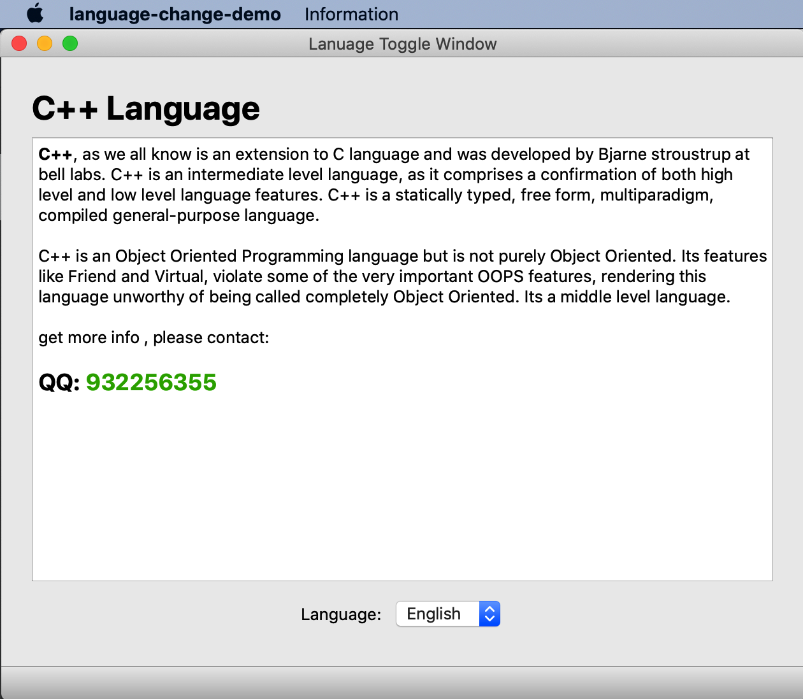
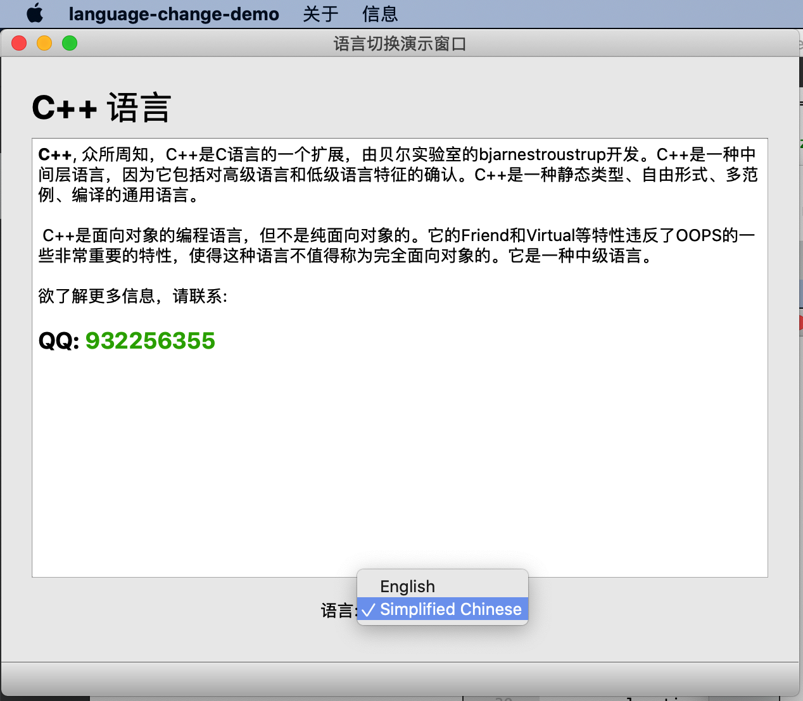
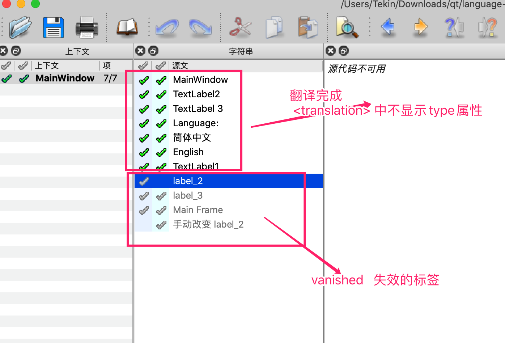

# QT 多语言动态切换 演示项目


QT 动态切换,即时翻译多语言


## 演示






## 原理


最新项目正好用到多语言,于是开始了我的多语言动态切换的学习之旅, 关于这个多语言切换官方的说明似乎无法实现, 我们先来看看官方的解释把:

### QTranslator

An object of this class contains a set of translations from a source language to a target language. QTranslator provides functions to look up translations in a translation file. Translation files are created using Qt Linguist.
The most common use of QTranslator is to: load a translation file, and install it using QCoreApplication::installTranslator().
Here's an example main() function using the QTranslator:
 int main(int argc, char *argv[])
 {
     QApplication app(argc, argv);

     QTranslator translator;
     // look up e.g. :/i18n/myapp_de.qm
     if (translator.load(QLocale(), QLatin1String("myapp"), QLatin1String("_"), QLatin1String(":/i18n")))
         QCoreApplication::installTranslator(&translator);
    
     QPushButton hello(QCoreApplication::translate("main", "Hello world!"));
     hello.resize(100, 30);
    
     hello.show();
     return app.exec();
 }

Note that the translator must be created before the application's widgets.
Most applications will never need to do anything else with this class. The other functions provided by this class are useful for applications that work on translator files.


根据官方的说明, 所用到的核心类库就2个 一个 QTranslator  一个 QCoreApplication::installTranslator ,  按照上面的说明网抽根本不能实现多语言的动态切换.  

​		要搞清楚原因,还需要从底层原理开始:


## 多语言却换原理

​        Qt内部采用的全Unicode编码，这从根本上保证了多国语界面实现的正确性和便捷性。Qt本身提供的linguist工具，就是来实现这个翻译过程的。实现多国语的步骤大体上说来有这么几步：

1、在需要被翻译的字符串前面标识tr，如QString str＝tr(“hello,world!”); ，这很重要，因为翻译工具会把源码中tr标识的字符串提取出来，翻译成其他语言，如果没有用tr标识的，不会被工具提取。在界面中输入的文字，默认已经是加上tr的了，所以在翻译时也能看见。

2、在工程文件***.pro中，添加一项 TRANSLATIONS ＋＝  ***.ts ****.ts 扩展名为.ts是翻译的源文件，表示生成这几个文件。一般我们会在命名中把区域加进去，更好的注释这些文件是用于什么语言的，比如中文大多会这样命名 demo_zh_CN.ts， zh_CN表示的就是中国。

```properties
TRANSLATIONS += \
    demo_zh_CN.ts \
    demo_en.ts
```


3、使用lupdate工具提取翻译源文件， 命令是这样的 #lupdate ***.pro ，或者通过Qt Creator的图形界面来生成***.ts文件。lupdate会解析***.pro即工程文件，生成TRANSLATIONS中的 ***.ts 几个文件，这些文件可以被linguist工具打开，按照提示一个一个的翻译成需要的文件，然后保存就OK，linguist的使用很简单，一看界面基本就会了。上面提到的这些工具都是Qt自带的。


如果有子窗口的话，子窗口通过模式对话框显示，子窗口翻译可以更新；如果用非模式对话框，子窗口翻译无法更新

当调用qApp->installTranslator(&translator);时就会给ui文件发送的 QEvent :: LanguageChange 事件，通过调用

### ui->retranslateUi(this)

来更新tr("XXX")字段

需要说明的时， 一般我们使用设计器来设计 界面 UI，也就是程序源码中我们看到的 ***.ui文件，在载入翻译器后，我们应该调用 ui->retranslateUi() ，这个函数实际上就是把 界面 控件的text重新载入一遍，

该函数的实现代码如下

~~~h
void retranslateUi(QMainWindow *MainWindow)
{
  MainWindow->setWindowTitle(QCoreApplication::translate("MainWindow", "MainWindow", nullptr));
  actionAboutMenu->setText(QCoreApplication::translate("MainWindow", "AboutMenu", nullptr));
  actionGithub->setText(QCoreApplication::translate("MainWindow", "Github", nullptr));
  label_2->setText(QCoreApplication::translate("MainWindow", "C++ Language", nullptr));
  label->setText(QCoreApplication::translate("MainWindow", "Language:", nullptr));
  language_box->setItemText(0, QCoreApplication::translate("MainWindow", "English", nullptr));
  language_box->setItemText(1, QCoreApplication::translate("MainWindow", "\347\256\200\344\275\223\344\270\255\346\226\207", nullptr));

  menuAbout->setTitle(QCoreApplication::translate("MainWindow", "About", nullptr));
  menuInformation->setTitle(QCoreApplication::translate("MainWindow", "Information", nullptr));
  //....省略其他
} // retranslateUi


~~~


关于 QTranslator::load有这样一句话。

The data is not copied. The caller must be able to guarantee that data will not be deleted or modified.

这段话明确的说明了，QTranslator在load以后，并没有把qm文件中的数据拷贝一份，而是在需要的时候去查询字符串。如果qm在这期间被删除或修改，对程序都是有影响的。扩展开来，QTranslator必须保证要一直有效，如果在函数中定义的局部变量，函数结束后就自动释放掉了，那么翻译工作就不能正常进行。所以建议在private中定义个成员变量 QTranslator* app_translator;来确保整个翻译工作的正确性。


废话不多说,上代码:


头文件定义

~~~h
#include <QTranslator>

//.....

public slots:
    void ChangeLanguage(int index);

protected:
    void changeEvent(QEvent *event); //这个是重写changeEvent事件

private:
    QTranslator *m_translator;
~~~


cpp源码实现

~~~cpp

MainWindow::MainWindow(QWidget *parent)
    : QMainWindow(parent),
    ui(new Ui::MainWindow),m_translator(new QTranslator)
{
    ui->setupUi(this);


    //监听语言下拉框改变事件
    connect(ui->language_box, QOverload<int>::of(&QComboBox::currentIndexChanged),[=](int index){
        ChangeLanguage(index);
    });
		//初始化是默认加载一个语言
     ChangeLanguage(0);

}

//执行语言切换
void MainWindow::ChangeLanguage(int index)
{
    QString exePath = QApplication::applicationDirPath();
    QString QmName;

    if(index == 1)
    {
        QmName = ":/demo_zh_CN.qm";
    }
    else
    {
        QmName =":/demo_en.qm";
    }

    cout<<index;
    cout<< QmName << exePath ;

    if( m_translator->load(QmName) )
    {
        // 每次只需 installTranslator 系统会自动发送一个QEvent::LanguageChange信号 通过重写eventChange事件可捕获
        //QEvent::LanguageChange  89  The application translation changed.
        qApp ->installTranslator(m_translator);

        cout<<"install OK";

        //这个非常关键, 重新翻译UI
//       ui->retranslateUi(this);

    }else{
        cout<<"load fail";
    }
}

/**
 * [virtual protected] void QWidget::changeEvent(QEvent *event)
 * @brief MainWindow::changeEvent 重写事件,捕获自己想要处理的事件进行处理
 * @param event
 */
void MainWindow::changeEvent(QEvent *event)
{
    //enum QEvent::Type
    // event->type(); 返回的是事件类型枚举  也就是int类型 QT中的枚举值都是int类型
    int type = event->type();
    switch (type) {
    case QEvent::LanguageChange:
        cout<<"捕获到语言改变事件";
        //重新翻译UI
        ui->retranslateUi(this);
        break;
    }

    //其他的事件交给你的基类(本类中是QWidget)去处理:  这里要注意,根据你的页面的基类有所不同, 具体需要看你的这个changeEvent来自哪里
    QWidget::changeEvent(event);

}
~~~


## ts标签说明


<translation type="xxx">

unfinished 表示翻译未完成

vanished  表示这个是失效的标签,可以删除了

obsolete 表示已过时  可以删除了


翻译文件定位, qt提供的工具默认通过代码行来定位

 <location filename="mainwindow.ui" line="57"/>

也可以通过制定控件的名称来定位如:

 <location filename="mainwindow.cpp"  name="label_1"/>

这里的 filename表示的是你的文件名, 有ui文件和cpp文件.  name 就是你页面的控件的名称

在ts文件中,每个文件一段 context  其中 <name>xxxx</name>表示页面名称, 

<message></message>  端表示要翻译的消息体

 <location filename="文件名" line="位置"/> 这个表示翻译所在的位置 

<source>代码中的语言</source>

  <translation>要翻译为的语言, 根据当前的ts文件不同</translation>  

如下:

~~~ts
<context>
    <name>AboutDialog</name>
    <message>
        <location filename="aboutdialog.ui" line="14"/>
        <source>Dialog</source>
        <translation>关于QT多语言动态切换示例</translation>
    </message>
//....
    <message>
        <location filename="aboutdialog.ui" line="66"/>
        <source>知道了</source>
        <translation>知道了</translation>
    </message>
</context>
~~~


一个完整的 qt  .ts 文件示例

~~~ts
<?xml version="1.0" encoding="utf-8"?>
<!DOCTYPE TS>
<TS version="2.1" language="zh_CN" sourcelanguage="en">
<context>
    <name>AboutDialog</name>
    <message>
        <location filename="aboutdialog.ui" line="14"/>
        <source>Dialog</source>
        <translation>关于QT多语言动态切换示例</translation>
    </message>
    <message>
        <location filename="aboutdialog.ui" line="29"/>
        <source>&lt;html&gt;&lt;head/&gt;&lt;body&gt;&lt;p align=&quot;center&quot;&gt;&lt;span style=&quot; font-size:18pt; font-weight:600; color:#35931b;&quot;&gt;About Language Toggle Demo&lt;/span&gt;&lt;/p&gt;&lt;/body&gt;&lt;/html&gt;</source>
        <translation>&lt;html&gt;&lt;head/&gt;&lt;body&gt;&lt;p align=&quot;center&quot;&gt;&lt;span style=&quot; font-size:18pt; font-weight:600; color:#35931b;&quot;&gt;关于QT多语言动态切换示例&lt;/span&gt;&lt;/p&gt;&lt;/body&gt;&lt;/html&gt;</translation>
    </message>
    <message>
        <location filename="aboutdialog.ui" line="66"/>
        <source>知道了</source>
        <translation>知道了</translation>
    </message>
</context>
<context>
    <name>MainWindow</name>
    <message>
        <location filename="mainwindow.ui" line="14"/>
        <source>MainWindow</source>
        <translation>语言切换演示窗口</translation>
    </message>
    <message>
        <location filename="mainwindow.ui" line="24"/>
        <source>C++ Language</source>
        <translation>&lt;h1&gt;C++ 语言&lt;/h1&gt;</translation>
    </message>
    <message>
        <location filename="mainwindow.ui" line="65"/>
        <source>Language:</source>
        <translation>语言:</translation>
    </message>
    <message>
        <location filename="mainwindow.ui" line="78"/>
        <source>简体中文</source>
        <translation>Simplified Chinese</translation>
    </message>
    <message>
        <location filename="mainwindow.ui" line="114"/>
        <source>About</source>
        <translatorcomment>关于</translatorcomment>
        <translation>关于</translation>
    </message>
    <message>
        <location filename="mainwindow.ui" line="120"/>
        <source>Information</source>
        <translation>信息</translation>
    </message>
    <message>
        <location filename="mainwindow.ui" line="130"/>
        <source>AboutMenu</source>
        <translation>关于</translation>
    </message>
    <message>
        <location filename="mainwindow.ui" line="135"/>
        <source>Github</source>
        <translation>Github开源分享</translation>
    </message>
    <message>
        <location filename="mainwindow.ui" line="73"/>
        <source>English</source>
        <translation>English</translation>
    </message>
</context>
</TS>


~~~


## Linguist 翻译工具

**支持html格式翻译**   即在翻译的文本中可以直接使用hmtl代码





